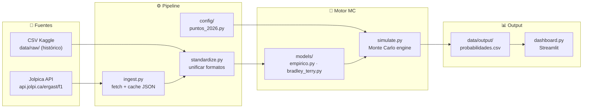
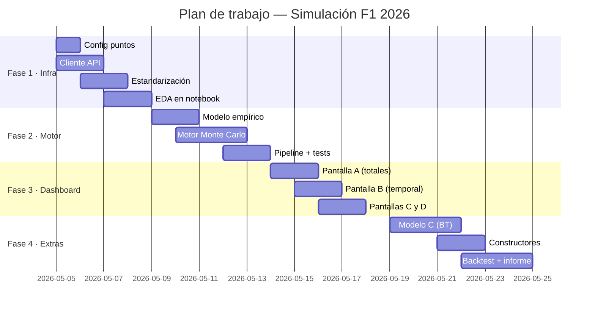

# Planificación · Simulación Campeonato F1 2026

> **Última actualización:** 2026-05-04  
> **Estado temporada 2026:** 4 de 22 rondas completadas (Ronda 4 = Miami GP, 2026-05-03)  
> **Líder actual:** Antonelli (Mercedes) — 100 pts · 3 victorias

---

## 1. Objetivos del proyecto

| Nivel | Entregable | Métrica clave |
|-------|-----------|---------------|
| **Campeonato completo** | Probabilidad de cada piloto de ser campeón, top 3, top 10 | $\hat{p}_i(\text{campeón})$ con intervalo MC |
| **Esperanza de puntos** | Distribución de puntos finales por piloto | $\mathbb{E}[\text{pts}_i]$, $\text{std}[\text{pts}_i]$ |
| **Carrera por carrera** | Serie temporal de $\hat{p}_i(\text{título})$ vs ronda | Curva actualizada tras cada GP real |
| **Constructores** *(extensión)* | Campeonato de equipos sumando ambos pilotos | $\hat{p}_j(\text{campeón constructores})$ |

**Ámbito MVP:** campeonato de **pilotos** con modelo empírico (A).  
**Extensiones:** constructores + modelo Bradley–Terry (C) + backtest.

---

## 2. Estado actual verificado (2026-05-04)

### 2.1 Grilla 2026 — 22 pilotos, 11 equipos

| Equipo | Piloto 1 | Piloto 2 |
|--------|----------|----------|
| Mercedes | Russell (RUS) | Antonelli (ANT) |
| Ferrari | Leclerc (LEC) | Hamilton (HAM) |
| McLaren | Norris (NOR) | Piastri (PIA) |
| Red Bull | Verstappen (VER) | Hadjar (HAD) |
| Aston Martin | Alonso (ALO) | Stroll (STR) |
| Alpine | Gasly (GAS) | Colapinto (COL) |
| Williams | Albon (ALB) | Sainz (SAI) |
| RB / Racing Bulls | Lawson (LAW) | Lindblad (LIN) |
| Haas | Bearman (BEA) | Ocon (OCO) |
| Audi *(ex-Sauber)* | Hülkenberg (HUL) | Bortoleto (BOR) |
| Cadillac *(nuevo)* | Bottas (BOT) | Pérez (PER) |

### 2.2 Standings tras Ronda 4 (API verificada)

| Pos | Piloto | Equipo | Pts | Wins |
|-----|--------|--------|-----|------|
| 1 | Antonelli | Mercedes | 100 | 3 |
| 2 | Russell | Mercedes | 80 | 1 |
| 3 | Leclerc | Ferrari | 59 | 0 |
| 4 | Norris | McLaren | 51 | 0 |
| 5 | Hamilton | Ferrari | 51 | 0 |
| 6 | Piastri | McLaren | 43 | 0 |
| 7 | Verstappen | Red Bull | 26 | 0 |
| 8 | Bearman | Haas | 17 | 0 |
| 9 | Gasly | Alpine | 16 | 0 |
| 10 | Lawson | RB | 10 | 0 |
| 11–22 | Resto | — | ≤7 | 0 |

### 2.3 Calendario 2026 completo (22 rondas)

| Rnd | GP | Fecha | Sprint? | Estado |
|-----|----|-------|---------|--------|
| 1 | Australia | 2026-03-08 | No | ✅ Corrido |
| 2 | China | 2026-03-15 | **Sí** | ✅ Corrido |
| 3 | Japón | 2026-03-29 | No | ✅ Corrido |
| 4 | Miami | 2026-05-03 | **Sí** | ✅ Corrido |
| 5 | Canadá | 2026-05-24 | **Sí** | ⏳ Pendiente |
| 6 | Mónaco | 2026-06-07 | No | ⏳ |
| 7 | Barcelona | 2026-06-14 | No | ⏳ |
| 8 | Austria | 2026-06-28 | No | ⏳ |
| 9 | Gran Bretaña | 2026-07-05 | **Sí** | ⏳ |
| 10 | Bélgica | 2026-07-19 | No | ⏳ |
| 11 | Hungría | 2026-07-26 | No | ⏳ |
| 12 | Países Bajos | 2026-08-23 | **Sí** | ⏳ |
| 13 | Italia | 2026-09-06 | No | ⏳ |
| 14 | España | 2026-09-13 | No | ⏳ |
| 15 | Azerbaiyán | 2026-09-26 | No | ⏳ |
| 16 | Singapur | 2026-10-11 | **Sí** | ⏳ |
| 17 | Estados Unidos | 2026-10-25 | No | ⏳ |
| 18 | México | 2026-11-01 | No | ⏳ |
| 19 | Brasil | 2026-11-08 | No | ⏳ |
| 20 | Las Vegas | 2026-11-22 | No | ⏳ |
| 21 | Qatar | 2026-11-29 | No | ⏳ |
| 22 | Abu Dhabi | 2026-12-06 | No | ⏳ |

**Sprints confirmados (CSV):** rondas 2, 4, 5, 9, 12, 16 (6 sprints).

---

## 3. Arquitectura de datos



### 3.1 Endpoints API verificados ✅

| Dato | Endpoint | Ejemplo |
|------|----------|---------|
| Calendario por año | `/{year}.json` | `/2026.json` → 22 carreras |
| Resultados carrera | `/{year}/{round}/results.json` | `/2026/1/results.json` → 22 pilotos |
| Resultados sprint | `/{year}/{round}/sprint.json` | `/2026/2/sprint.json` |
| Standings pilotos | `/{year}/driverStandings.json` | `/2026/driverStandings.json` → round 4 |
| Standings por ronda | `/{year}/{round}/driverStandings.json` | `/2025/5/driverStandings.json` |
| Standings constructores | `/{year}/constructorStandings.json` | análogo |

**Base URL:** `https://api.jolpi.ca/ergast/f1`  
**Rate limit:** ~4 req/s (sin key). Paginación: `?limit=100&offset=0`.

### 3.2 CSV locales disponibles (`data/raw/`)

| Archivo | Registros | Columnas clave |
|---------|-----------|----------------|
| `results.csv` | ~26k | `resultId, raceId, driverId, constructorId, grid, position, points, statusId` |
| `races.csv` | ~1190 | `raceId, year, round, circuitId, name, date, sprint_date` |
| `sprint_results.csv` | ~700 | mismo esquema que results |
| `drivers.csv` | ~860 | `driverId, driverRef, forename, surname, nationality` |
| `constructors.csv` | ~210 | `constructorId, constructorRef, name, nationality` |
| `driver_standings.csv` | ~34k | `raceId, driverId, points, position, wins` |

**Cobertura:** 2009–2026 (races.csv ya incluye 2026). Resultados hasta ronda 4 por API.

### 3.3 Estructura de directorios propuesta

```
simulacion-2026/
├── config/
│   └── puntos.py              # Tabla de puntos 2026 + desempate
├── data/
│   ├── raw/                   # CSV Kaggle (histórico, no modificar)
│   ├── actual/                # Snapshots JSON de la API
│   │   ├── calendar_2026.json
│   │   ├── standings_r04.json
│   │   └── results_r01.json … results_r04.json
│   └── output/                # Resultados de simulación
│       ├── probabilidades.csv
│       └── serie_temporal.csv
├── src/
│   ├── ingest.py              # Cliente API + guardado
│   ├── standardize.py         # Unificar CSV y JSON en DataFrames
│   ├── models/
│   │   ├── empirico.py        # Modelo A: distribución empírica
│   │   └── bradley_terry.py   # Modelo C: Plackett–Luce (extensión)
│   ├── simulate.py            # Motor Monte Carlo
│   └── pipeline.py            # Orquestador: ingest → sim → output
├── dashboard.py               # Streamlit app
├── notebooks/
│   └── exploracion.ipynb      # EDA y prototipado
├── tests/
│   └── test_simulate.py
├── requirements.txt
├── PLANIFICACION.md
└── README.md
```

---

## 4. Reglamento de puntos 2026

### 4.1 Carrera principal (top 10)

| Pos | 1° | 2° | 3° | 4° | 5° | 6° | 7° | 8° | 9° | 10° |
|-----|----|----|----|----|----|----|----|----|----|----|
| Pts | 25 | 18 | 15 | 12 | 10 | 8  | 6  | 4  | 2  | 1  |

Posiciones 11°–22°: **0 puntos**.  
**Vuelta rápida:** no otorga punto extra (eliminado desde 2025).

### 4.2 Sprint (top 8)

| Pos | 1° | 2° | 3° | 4° | 5° | 6° | 7° | 8° |
|-----|----|----|----|----|----|----|----|----|
| Pts | 8  | 7  | 6  | 5  | 4  | 3  | 2  | 1  |

Posiciones 9°–22°: **0 puntos**.

### 4.3 Puntos máximos teóricos por temporada

- **Sin sprints:** 22 × 25 = **550 pts**
- **Solo sprints:** 6 × 8 = **48 pts**
- **Total máximo teórico:** 550 + 48 = **598 pts**

### 4.4 Desempate FIA (countback)

1. Mayor número de **victorias en carrera** (no sprint)
2. Mayor número de **2° puestos en carrera**
3. Continúa: 3°, 4°, ... hasta encontrar diferencia
4. Último recurso: decisión FIA

**Implementar en `config/puntos.py`** como diccionario configurable.

---

## 5. Métodos matemáticos

### 5.1 Estado del sistema

Tras ronda $r$: vector $\mathbf{s}^{(r)} \in \mathbb{R}^{22}$ de puntos acumulados.  
Rondas restantes: $r+1, \ldots, R=22$.  
Vector de victorias: $\mathbf{w}^{(r)} \in \mathbb{N}^{22}$ para desempate.

### 5.2 Modelo A — Empírico por piloto (MVP)

**Idea:** para cada piloto $i$, construir distribución empírica de **puntos por carrera** a partir de ventana histórica reciente.

**Ventana de entrenamiento sugerida:** temporadas 2023–2025 (3 años), filtrando por piloto activo en 2026.

> **Problema clave:** varios pilotos 2026 son rookies (Antonelli, Lindblad, Colapinto, Hadjar). Para estos, usar las primeras $r$ rondas de 2026 como muestra empírica. Si $r < 3$, poolear con datos del equipo/constructor.

**Muestreo por carrera futura:**
1. Para cada GP pendiente $k = r+1, \ldots, R$:
   - Si el GP tiene sprint: muestrear **puntos_carrera** + **puntos_sprint** independientemente
   - Si no tiene sprint: muestrear solo **puntos_carrera**
2. Los muestreos son **i.i.d. por piloto** (supuesto simplificador)

**Variantes de muestreo:**
- **(A1) Bootstrap puro:** elegir uniformemente entre los puntos históricos observados
- **(A2) Kernel suavizado:** añadir ruido $\varepsilon \sim \mathcal{N}(0, \sigma^2)$ al bootstrap para evitar masas discretas extremas
- **(A3) Por posición:** muestrear **posición de llegada** (no puntos) y luego mapear con tabla de puntos 2026

> **Recomendación MVP:** variante **A3** (muestrear posición), porque respeta la restricción de que sólo un piloto puede obtener cada posición.

### 5.3 Modelo C — Bradley-Terry / Plackett–Luce (extensión)

Cada piloto $i$ tiene fuerza latente $\theta_i > 0$. La probabilidad de que $i$ gane contra $j$ es:

$$P(i \succ j) = \frac{\theta_i}{\theta_i + \theta_j}$$

Para simular un orden completo de llegada se usa **Plackett–Luce:**

$$P(\text{orden } \pi) = \prod_{k=1}^{n} \frac{\theta_{\pi(k)}}{\sum_{j=k}^{n} \theta_{\pi(j)}}$$

**Equivalente computacional:** para cada piloto, generar $G_i \sim \text{Gumbel}(0,1)$; el score es $\log\theta_i + G_i$; ordenar scores de mayor a menor → orden de llegada.

**Estimación de $\theta_i$:** MLE sobre resultados históricos (paquete `choix` en Python o implementación propia).

### 5.4 Motor Monte Carlo

```python
# Pseudocódigo
for b in range(B):  # B = 10_000 a 100_000
    puntos = standings_actuales.copy()      # shape (22,)
    victorias = wins_actuales.copy()        # shape (22,)
    posiciones = [[] for _ in range(22)]    # para desempate

    for ronda in rondas_pendientes:         # rondas 5..22
        orden = modelo.sample_race(ronda)   # permutación de 22 pilotos
        pts = asignar_puntos(orden, tipo='race')
        puntos += pts
        victorias[orden[0]] += 1
        for i, pos in enumerate(orden):
            posiciones[pos].append(i+1)

        if ronda.tiene_sprint:
            orden_sprint = modelo.sample_race(ronda, tipo='sprint')
            pts_sprint = asignar_puntos(orden_sprint, tipo='sprint')
            puntos += pts_sprint

    campeon = resolver_desempate(puntos, victorias, posiciones)
    resultados[b] = campeon
```

**Salidas:**

| Métrica | Fórmula |
|---------|---------|
| $\hat{p}_i(\text{campeón})$ | $\frac{1}{B}\sum_b \mathbf{1}\{\text{campeón}_b = i\}$ |
| Error MC estándar | $\sqrt{\hat{p}(1-\hat{p})/B}$ |
| $\hat{p}_i(\text{top } k)$ | $\frac{1}{B}\sum_b \mathbf{1}\{\text{rank}_b(i) \leq k\}$ |
| $\mathbb{E}[\text{pts}_i]$ | $\frac{1}{B}\sum_b \text{pts}_{i,b}$ |
| $\text{std}[\text{pts}_i]$ | desviación estándar muestral |

### 5.5 Vista carrera por carrera

**Procedimiento (MVP):**

1. Tras cada GP real corrido, ejecutar `ingest.py` → nuevo snapshot en `data/actual/`
2. Re-ejecutar Monte Carlo desde el nuevo snapshot
3. Guardar fila `(ronda, piloto, p_campeon, p_top3, E_pts)` en `data/output/serie_temporal.csv`
4. Dashboard grafica la serie completa

**Resultado:** curva de $\hat{p}_i(\text{título})$ vs número de ronda, actualizada en vivo.

### 5.6 Calibración y backtest (opcional)

- **Temporadas de prueba:** 2021 (Verstappen vs Hamilton), 2023 (Verstappen dominante)
- **Protocolo:** a mitad de temporada (ronda 10), correr simulación y comparar $\hat{p}$ vs resultado real
- **Métricas:** Brier score multiclass, log-loss, correlación de Spearman ($\hat{p}$ vs posición final)

---

## 6. Implementación técnica — Plan paso a paso

### Fase 1 · Infraestructura (Semana 1)

| # | Tarea | Archivo | Detalle |
|---|-------|---------|---------|
| 1.1 | Config de puntos | `config/puntos.py` | Diccionarios `RACE_POINTS`, `SPRINT_POINTS`, `SPRINT_ROUNDS_2026`, función `desempate()` |
| 1.2 | Cliente API | `src/ingest.py` | `fetch_calendar(year)`, `fetch_results(year, round)`, `fetch_standings(year)`, `fetch_sprint(year, round)` — guardar JSON en `data/actual/` |
| 1.3 | Estandarización | `src/standardize.py` | Leer CSV + JSON → DataFrames unificados: `get_race_results(year, rounds)`, `get_standings(year, round)` |
| 1.4 | Setup proyecto | `requirements.txt` | Agregar `streamlit`, `matplotlib`, `seaborn`, `scipy` |

### Fase 2 · Modelo y simulación (Semana 2)

| # | Tarea | Archivo |
|---|-------|---------|
| 2.1 | Modelo empírico | `src/models/empirico.py` — clase `EmpiricalModel` con `fit(df_results)` y `sample_race()` |
| 2.2 | Motor MC | `src/simulate.py` — función `run_simulation(standings, modelo, rondas_restantes, B, seed)` |
| 2.3 | Pipeline | `src/pipeline.py` — orquesta ingest → modelo → simulación → CSV output |
| 2.4 | Tests | `tests/test_simulate.py` — verificar puntos, desempate, reproducibilidad con seed |

### Fase 3 · Dashboard (Semana 3)

| # | Tarea | Archivo |
|---|-------|---------|
| 3.1 | Pantalla A: Totales | `dashboard.py` — tabla + barras de $\hat{p}(\text{campeón})$ |
| 3.2 | Pantalla B: Temporal | Gráfico de líneas $\hat{p}_i$ vs ronda |
| 3.3 | Pantalla C: Próximo GP | Distribución simulada marginal |
| 3.4 | Pantalla D: Parámetros | Modelo, $B$, seed, fecha datos, reglamento |

### Fase 4 · Extensiones (Semana 4, si hay tiempo)

| # | Tarea |
|---|-------|
| 4.1 | Modelo Bradley–Terry en `src/models/bradley_terry.py` |
| 4.2 | Campeonato de constructores |
| 4.3 | Backtest con temporadas 2021/2023 |
| 4.4 | Comparación de modelos A vs C |

---

## 7. Diseño del dashboard (Streamlit)

### Pantalla A · Standings + probabilidades

```
┌─────────────────────────────────────────────────┐
│  🏆 Simulación F1 2026 — Estado actual          │
│  Datos hasta: Ronda 4 (Miami GP)                │
│  Simulaciones: B = 50,000 · Seed: 42            │
├─────────────────────────────────────────────────┤
│  [Tabla interactiva]                             │
│  Piloto | Equipo | Pts | P(Campeón) | P(Top 3)  │
│  ANT    | MER    | 100 | 34.2%      | 68.1%     │
│  RUS    | MER    | 80  | 22.7%      | 55.4%     │
│  ...                                            │
├─────────────────────────────────────────────────┤
│  [Gráfico de barras horizontales P(campeón)]     │
│  ████████████████████ ANT 34.2%                  │
│  █████████████       RUS 22.7%                   │
│  ████████            LEC 12.5%                   │
└─────────────────────────────────────────────────┘
```

### Pantalla B · Serie temporal

```
┌─────────────────────────────────────────────────┐
│  📈 P(título) por ronda                          │
│  Filtro: Top N pilotos [slider: 5]              │
├─────────────────────────────────────────────────┤
│  100%│                                          │
│     │  ╲                                        │
│  50%│   ╲___ANT                                 │
│     │       ╱ RUS                               │
│   0%│──────────────────────                     │
│     R0  R1  R2  R3  R4  ...                     │
└─────────────────────────────────────────────────┘
```

### Pantalla C · Detalle próximo GP

- Distribución de posiciones esperadas para el próximo GP
- Histograma de puntos por piloto para esa carrera

### Pantalla D · Parámetros y transparencia

- Modelo activo (A empírico / C Bradley–Terry)
- $B$ (réplicas), semilla, ventana de entrenamiento
- Fecha/hora de última ingesta API
- Versión del reglamento de puntos

---

## 8. Riesgos, supuestos y mitigaciones

| Riesgo | Impacto | Mitigación |
|--------|---------|------------|
| **Pocos datos 2026** (solo 4 rondas al inicio) | Distribuciones empíricas muy ruidosas | Poolear con historial 2023–2025; modelo C más robusto con pocos datos |
| **Rookies sin historial** (Antonelli, Lindblad, Colapinto) | No hay distribución empírica previa | Usar datos del equipo/constructor como proxy; recalibrar tras cada ronda |
| **Cambio de reglamento técnico 2026** (autos nuevos) | Historial previo menos comparable | Ponderar más las primeras rondas 2026; documentar supuesto en informe |
| **API no disponible / rate limit** | No se puede actualizar en vivo | Fallback a CSV locales; guardar snapshots JSON con cada ejecución |
| **Supuesto i.i.d. entre carreras** | Ignora racha de forma, upgrades de auto | Reconocer limitación; modelo C mitiga parcialmente con parámetros adaptativos |
| **Máximo 22 pilotos** (no 20 como años anteriores) | Modelos de posición necesitan ajustar | Parametrizar N_DRIVERS desde standings, no hardcodear |
| **Sauber → Audi, nuevo equipo Cadillac** | constructorId cambia; CSV histórico no coincide | Mapeo explícito en `standardize.py` |

---

## 9. Cronograma sugerido



---

## 10. Stack técnico

| Componente | Tecnología | Versión mínima |
|-----------|-----------|----------------|
| Lenguaje | Python | 3.10+ |
| Datos | pandas, numpy | 2.0+, 1.24+ |
| HTTP | requests | 2.28+ |
| Simulación | numpy (RNG) | — |
| Visualización | matplotlib, seaborn | — |
| Dashboard | Streamlit | 1.30+ |
| Estadística | scipy (stats) | — |
| Modelo C | choix (Bradley–Terry) | opcional |
| Tests | pytest | — |

### `requirements.txt` actualizado

```
pandas>=2.0
numpy>=1.24
requests>=2.28
matplotlib>=3.7
seaborn>=0.12
streamlit>=1.30
scipy>=1.10
pytest>=7.0
choix>=0.3
```

---

## 11. Referencias

| Recurso | URL |
|---------|-----|
| API Jolpica (Ergast compat) | https://api.jolpi.ca/ergast/f1/ |
| Repo Jolpica | https://github.com/jolpica/jolpica-f1 |
| Dataset Kaggle (F1 histórico) | Buscar "Formula 1 World Championship 1950 to Present" |
| FIA Sporting Regulations 2026 | https://www.fia.com/regulation/category/110 |
| Bradley–Terry model | https://en.wikipedia.org/wiki/Bradley%E2%80%93Terry_model |
| Plackett–Luce | https://en.wikipedia.org/wiki/Luce%27s_choice_axiom |
| Librería `choix` | https://github.com/lucasmaystre/choix |
